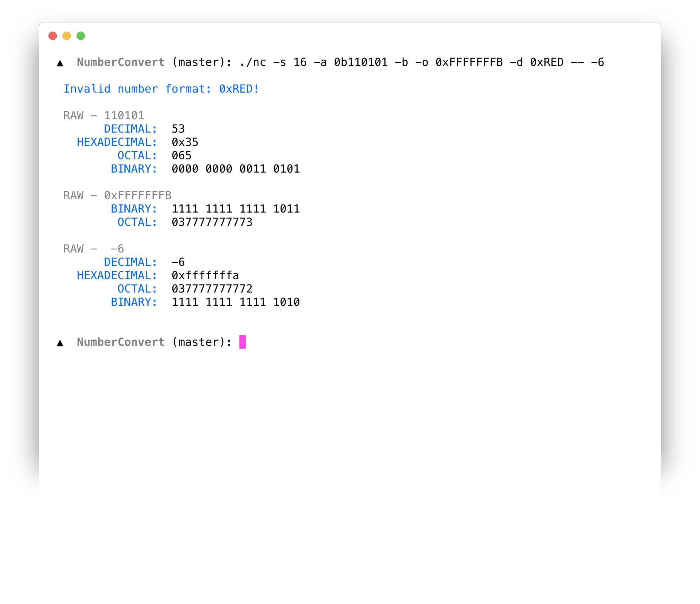

# Number Convert

This is a small tool to convert number to different formats. 



## Generate

We will build it with flag `-std=gnu99`, cause we use some uitility that c99 does not support.
Here is the command:

```
$ make
```

## Usage 

```
  Usage: ./nc [options]

  Options:

    -V, --version                 output program version
    -h, --help                    output help information
    -a, --all <num>               convert number to all formats
    -b, --bin [num]               convert number to binary format
    -d, --dec [num]               convert number to unsigned decimal format
    -H, --hex [num]               convert number to hex format
    -o, --oct [num]               convert number to octal format
    -s, --signed [num]            treat number as signed and set output bits
```

Now, it supports to convert several numbers one time. By changing the macro `MAX_NUMBERS` to modify the 
amounts of number which you want to convert at one time.


## Example

We define the number input format:

+  binary   0bxxxxx
+  octal    0xxxxx
+  hex      0x/0X
+  dec      +123/-123    [do not started with 0]

Here some examples:

1. convert two different numbers into binary format

```
$ ./nc -b 123 -b 0x123 
```

2. convert a decimal to other three different format

```
$ ./nc -a 123
```

3. convert number1 to decimal and number2 to binary and octal

```
$ ./nc -d number1 -b -o number2
```

4. convert negative number to other format

```
$ ./nc -a -- -5
```

more....

> Note:
>  When convert negative number, we need to add `--` before number.

